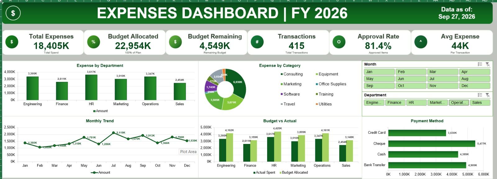

# Excel Dashboard Projects

I created two interactive Excel dashboards to practice data analysis and visualization.

## Sales Dashboard (2024–2025)

Shows total revenue, profit, orders, units sold, and profit margin. The charts compare monthly revenue and profit, sales by category, region and sales channel, and the top 10 products. Slicers let users filter the results.

## Expense Dashboard (FY 2026)

Shows total expenses, allocated budget, remaining budget, transactions, approval rate, and average expense. The charts compare spending by department, category and payment method, as well as actual spending against the budget. Month and department slicers let users filter the results.

## Project files

The Excel files for both dashboards are available above in this repository.
Excel dashboard projects for data analysis and visualization practice
